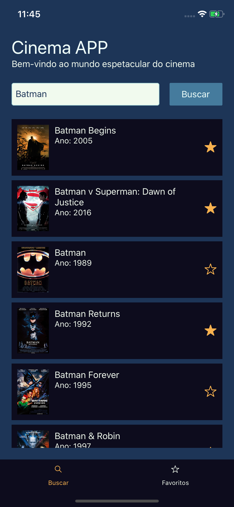
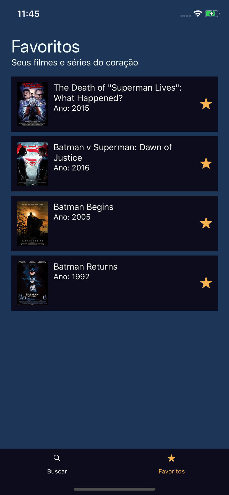
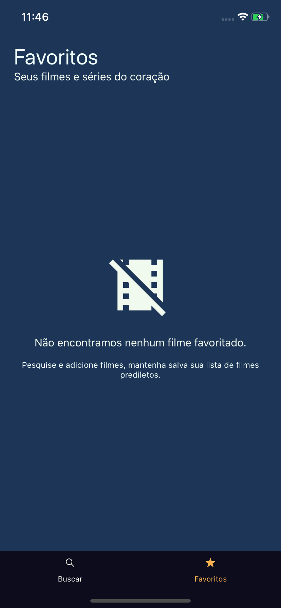

# CinemApp

## Sobre o repositório

Este repositório é um fork do desafio da Sthima para a vaga de
Desenvolvedor Javascript, a descrição completa do desafio pode
ser encontrada no [arquivo CHALLENGE.md](./CHALLENGE.md).

## Iniciando

A base do desafio é criar um Aplicativo ou SPA que conectado a API fornecida pela The Open Movie Database [OMDb](http://www.omdbapi.com/) e permita que nosso usuário faça buscas no catálogo de filmes e possa ter um registro local dos seus filmes favoritos.

Para o desafio optei por utilizar React Native e construir uma aplicação multiplataforma com algumas bibliotecas para chegar ao resultado esperado.

## Solução

|      Tela principal      |    Tela de Favoritos     | Tela de favoritos (Vazia) |
| :----------------------: | :----------------------: | :-----------------------: |
|  |  |   |

O aplicativo busca na base da OMDb os filmes digitados pelo usário, e caso clique na estrela a direita do filme ele armazena na sua coleção local de favoritos.

### Pré requisitos

Para utilizar os projetos é necessário ter o Node instalado na máquina, o projeto foi criado utilizando node na versão 12.16.3 download [aqui](https://nodejs.org/en/).

O projeto utilizou como base de sua criação o React Native CLI, para utilizar o projeto você deve ter o Xcode ou Android Studio na maquina para começar, além disso alguns passos adicionais são necessarios e variam de sistema operacional, felizmente a própia documentação do React Native entrega um suporte muito bom para a configuração do ambiente disponível no [link](https://reactnative.dev/docs/environment-setup) na seção React Native CLI Quickstart.

## Instalação

Para rodar o projeto basta utilizar o comando dentro da pasta _cinemapp_:

```bash
  $ npm install
  # ou caso utilize yarn
  $ yarn install
```

## Rodando a aplicação

```bash
# Android
$ npm run android
# ou caso utilize yarn
$ yarn android

#iOS
$ npm run ios
# ou caso utilize yarn
$ yarn ios
```

## Executando os testes

```bash
  $ npm run test
  # ou caso utilize yarn
  $ yarn test
```

#### Observação: Na plataforma Android, um emulador deve estar aberto ou dispositivo deve estar conectado via usb para execução.

O projeto utiliza além do react native cli, as seguintes bibliotecas:

- Axios (recuperar os dados da Api)
- React Navigation (gerenciar a navegação entre as páginas)
- React Native Vector Icons (opções de ícones para a aplicação)
- Redux & React Redux (estado global para a aplicação)
- Redux Persist & Async Storage (persistir dados na aplicação mesmo após fecharmos a aplicação)
- Styled Components (auxiliar na criação dos componentes, estilos, e temas)
- EsLint & Prettier (manter o codigo padronizado e coeso)
- Jest & React Test Renderer (testes automatizados)

## Estrutura do projeto

    src/
      -assets/
      -components/
      -database/
      -pages/
        -Favorites/
        -Main/
      -redux/
      -routes/
      -services/

### assets

Pasta para a definicação do tema padrão da nossa aplicação.

### components

Nesse diretório ficam os componentes que podem ser compartilhados no nosso projeto, componentes 'comuns' para todo o projeto.

### database

Nosso aplicativo utiliza a biblioteca redux-persist para persistir os dados em conjunto com o Async Storage, porém caso o desenvolvedor queira salvar e recuperar informações sem auxilio do redux, já existe toda uma estrutura criada com exemplo nesse diretório.

### pages

O diretório onde ficam armazenadas as páginas, cada página fica dentro do seu respectivo diretório, a página tem como principal responsabilidade buscar e tratar dados (através do services e redux) para serem repassados para os componentes.

##### Observação

Caso a pagina necessite de estilos própios eles são encontrados no arquivos _styles.js_ que ficam dentro do diretório da página e não devem ser importados por nenhuma outra página, caso isso ocorra ele deve ser deslocado para o diretório \_components- e virar dependência de ambas as páginas.

### redux

A pasta contém a configuração da nossa store, da biblioteca redux-persist.
O projeto utiliza o conceito a estrutura do Redux com o padrão Duck, nesse padrão agregamos as _actions_, _reducers_ e _types_ em um único arquivo, caso queira conhecer mais sobre o padrão sugiro os links:

- [Ducks Modular Redux](https://github.com/erikras/ducks-modular-redux)
- [Scaling your Redux App with ducks](https://www.freecodecamp.org/news/scaling-your-redux-app-with-ducks-6115955638be/)

### routes

Organização das rotas da aplicação utilizando react navigation, esse arquivo também contém a criação e configuração da nossa _TabBar_.

### services

O diretório services armazena os arquivos responsáveis por recuperar e enviar dados para nossas API's.

### mocks & tests

Diretorios para os nossos testes automatizados e mocks utilizados por eles, inicialmente apenas com os testes dos nossos reducers.

### android & ios

Pastas criadas por nosso react native cli com o código e configurações das plataformas nativas.
